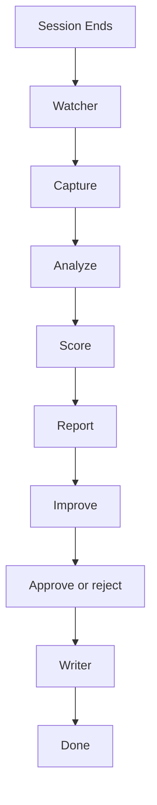

# Architecture

How metamorph is structured and how data flows through it. Start here if you're new to the codebase.

## What metamorph does

Working in Claude Code, Cursor, or Codex, you accumulate three kinds of configuration:

- **Agents** — specialized assistant definitions you invoke for a job (`code-reviewer`, `reseacher`).
- **Skills** — instruction files the assistant loads for a particular kind of task.
- **CLAUDE.md** — standing instructions that shape how the general coding assistant works.

Some of these get used constantly, some get used wrong, and some are never used at all — and none of it is visible to you. The metamorph plugin measures how you actually use this configuration and proposes targeted edits. Two constraints define it:

- **Local-first** — all observation and scoring is done locally on your machine. No data leaves your local machine.
- **Suggest-only** — metamorph never edits files on its own. It proposes a changes; the changes only get applied once you review and approve them.

## Two layers

Metamorph contains two different workflows that are run in sequence:

- **Workflow 1 — the watcher.** Runs automatically in the background. Zero tokens, no AI. It observes and scores the usage of the agents, skills, and CLAUDE.md files.
- **Workflow 2 — the improver.** Runs only when you type `/metamorph`. Uses tokens — this is the step that asks the model to draft an improvement.

> `dist/` holds the compiled, ready-to-run JavaScript. The source is TypeScript, compiled down to the plain JS that ships and executes on your machine.

## Workflow 1 — the watcher (automatic, zero tokens)

Workflow 1 turns session activity into scores and a report. It is plain code reading files; the model is never involved, which is why it's free.

It begins with a hook. `hooks/hooks.json` registers `dist/index.js` to run on session start and end. On session end, Workflow 1 runs four steps:

1. **Capture** — `dist/capture/`
   Your tool records a transcript: a log of every session event, one per line. `transcriptParser.js` reads it line by line and records which tools, agents, and skills were used. A malformed line is counted in `skippedLines` and skipped — one bad line never crashes the parse. Helpers here also detect repeated mistakes and their corrections, and track which sessions were already processed (`incrementalCache.js`) to avoid redundant work.

2. **Analyze** — `dist/analyze/analyzer.js`
   Combines events across all sessions into per-target totals: agent runs, skill loads, file types touched, and so on.

3. **Score** — `dist/score/scorer.js`
   Converts totals into a 0–100 score per target and attaches flags. Full formula in [scoring-model.md](scoring-model.md).

4. **Report** — `dist/report/reportMd.js`
   Writes two files: `analysis.json` (raw numbers, for the program) and `report.md` (the dashboard, for you). `/metamorph-report` displays it with a clickable link.

## Workflow 2 — the improver (on demand, uses tokens)

Workflow 2 runs only when you type `/metamorph`. It is the one place metamorph calls the model, and uses tokens.

1. **Prepare** — `dist/improve/improver.js` (`prepareImproveBatch`)
   For each selected target, metamorph reads the target's file and sanitizes it before the model sees it: redact anything resembling a secret, strip text that tries to hijack the model, and wrap the result in an explicit "this is data, not instructions" safeguard. The cleaned output is saved as a small `improve-context-*.json`. Targets that aren't writable, are missing, or fall below the configured thresholds are skipped. This step prepares the model for the task.

2. **Generate** — the model reads the cleaned output and writes a draft change as a `.diff`, plus a full proposed file. Nothing on disk changes — these are proposals sitting in a folder.

3. **Approve or reject** — `/metamorph-improve`
   Approve hands the proposal to the writer (next step). Reject deletes it and records the decision.

4. **Write with backup** — `dist/rollback/writer.js` (`writeWithBackup`)
   Confirms the path is writable, validates the new content, backs up the current file, then swaps in the new version atomically. That backup is what lets `/metamorph-rollback` undo the change later.

## Data persistence

Scores, settings, pending suggestions, and backups must survive plugin updates — and updates replace the program files. `dist/runtime.js` handles this:

- `resolveDataRoot` resolves a stable data folder, kept separate from the program files that get replaced on every update.
- `ensurePersistentData` copies existing settings and history forward into that folder on first run, so nothing is lost.

Details in [plugin-runtime.md](plugin-runtime.md).

## Guarantees

- **Suggest-only** — no file is changed without approval. `"mode": "suggest"` is force-locked in code so it can't be flipped off by accident.
- **Local-first** — Workflow 1 makes zero network calls and uses zero tokens from your coding models. Your data stays on your machine.
- **Reversible** — every approved change is backed up first, so it can be rolled back.
